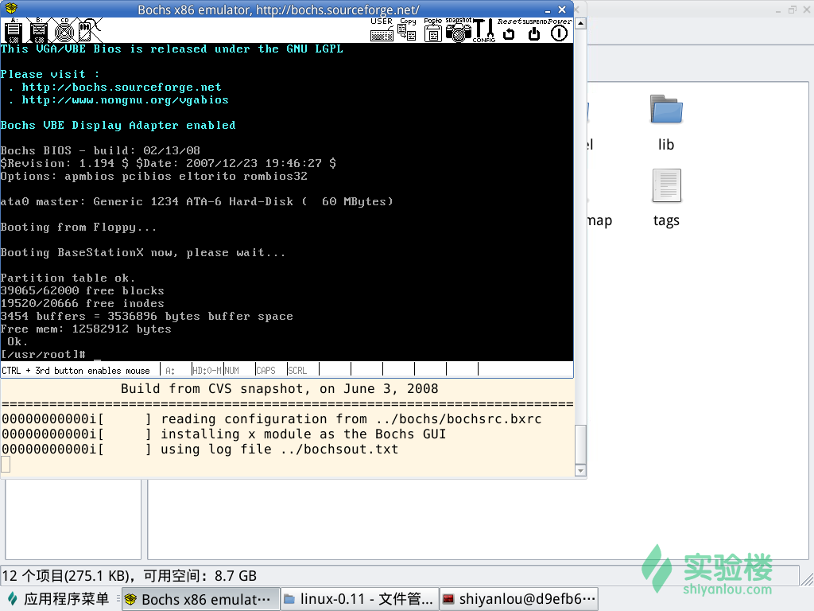
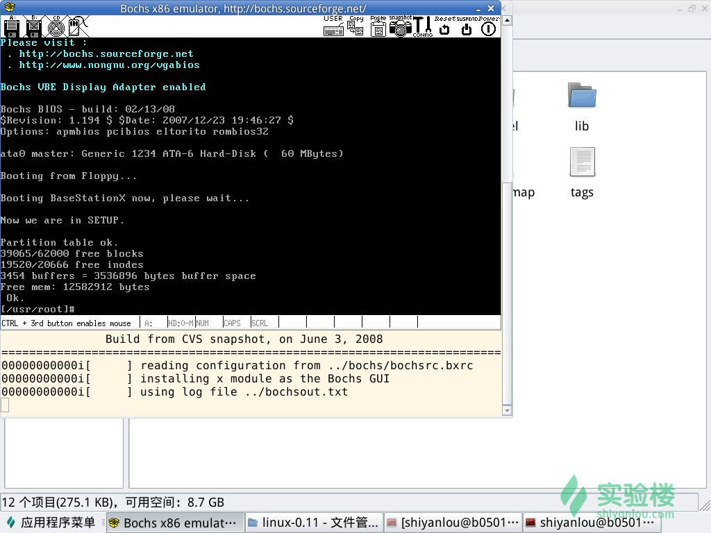
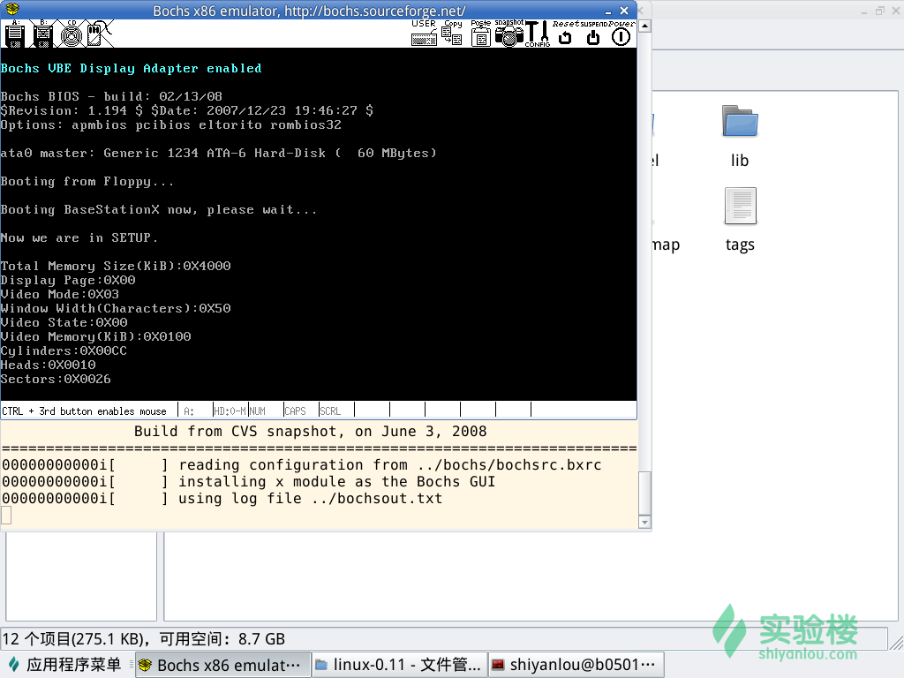
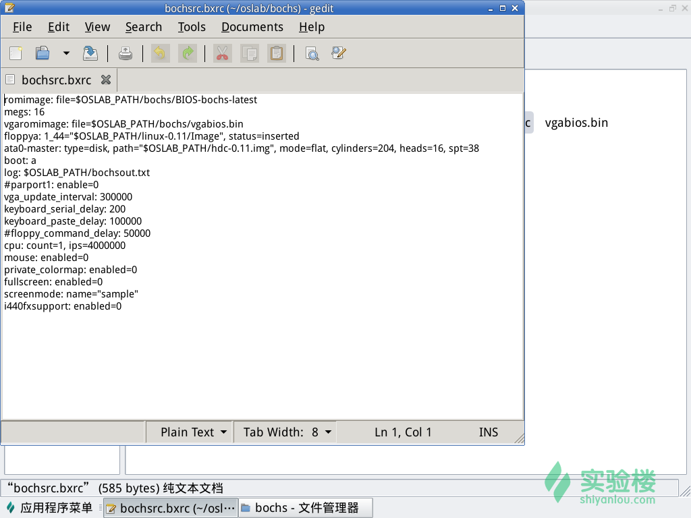

# 实验名称：操作系统的引导

## 一、实验目的：

1. 熟悉hit-oslab工作平台；
2. 建立对操作系统引导过程的深入认识；
3. 掌握操作系统的基本开发过程
4. 初步接触Linux 0.11操作系统。

## 二、实验仪器：

Ubuntu操作系统。

## 三、相关资料：

1. [操作系统的引导 - 实验楼](https://www.shiyanlou.com/courses/115/labs/568/document)[链接]
2. 李治军、刘宏伟 著《操作系统原理、实现与实践》[图书]，高等教育出版社，2018
3. 赵炯 著《Linux内核完全注释》[图书]，机械工业出版社，2004

## 四、实验内容：

1. 改写文件`bootsect.s`，修改系统徽标（即logo）：
   打开目录`~/oslab/linux-0.11/boot`，然后用gedit软件打开文件`bootsect.s`， 将文件`bootsect.s`第98行改为：

   ```
       mov    cx,#46
   ```

   将文件`bootsect.s`第246至247行改为：

   ```
       .ascii "Booting BaseStationX now, please wait…"
       .byte 13,10
   ```

   在目录`~/oslab/linux-0.11`下执行：

   ```
   make
   ../run
   ```

   运行Bochs虚拟机，运行结果如图1所示；
   图1 

2. 终止Bochs虚拟机运行，然后改写文件`setup.s`，通知用户程序"setup"正在运行：
   打开目录`~/oslab/linux-0.11/boot`，然后用gedit软件打开`setup.s`。
   在文件`setup.s`的第35行和第36行之间增加如下代码：

   ```assembly
       mov     ax, #SETUPSEG   ! Read cursor position first.
       mov     es, ax
       mov     ah, #0x03
       mov     bh, #0
       int     0x10
       mov     cx, #26      !Print "Now we are in SETUP." on the screen.   
       mov     bx, #0x0007
       mov     bp, #msg2
       mov     ax, #0x1301
       int     0x10
   ```

   在刚刚修改后的文件`setup.s`的第233行和第234行之间增加如下代码：

   ```
   msg2:
       .byte 13,10
       .ascii "Now we are in SETUP."
       .byte 13,10,13,10
   ```

   在路径`~/oslab/linux-0.11`下执行：

   ```
   make
   ../run
   ```

   运行Bochs虚拟机，运行结果如图2所示；
   图2 

3. 终止Bochs虚拟机运行，然后继续改写文件`setup.s`，使得"setup"能获取硬件参数，并将硬件输出到屏幕上，同时使"setup"不再加载Linux内核，保持上述信息显示在屏幕上：
   第2步修改后的文件`setup.s`的第1至52行代码保留，仍作为该步修改后的第1至52行代码。
   以下是修改后文件`setup.s`的第53至69行，该段代码实现的功能是获取扩展内存大小并输出内存总容量

   ```assembly
   ! Get memory size (extended mem, kB)
   
       mov     ah,#0x88
       int     0x15
       mov     [2], ax
       mov     cx, #23
       mov     bx, #0x0007
       mov     bp, #msg3
       mov     ax, #0x1301
       int     0x10
       mov     dx, [2]
       add     dx, #0x400  !Print the total memory.
       mov     cx, #4
       call    printargs
   ```

   以下是修改后的文件`setup.s`第70至113行，该段代码实现的功能是获取显示页面、显示模式和字符列数（屏幕宽度）并输出

   ```assembly
   ! Get video-card data:
   
       mov     ah,#0x0f
       int     0x10
       mov     [4],bx        ! bh = display page
       mov     [6],ax        ! al = video mode, ah = window width
   
       mov     ah, #0x03
       mov     bh, #0
       int     0x10
       mov     cx, #13
       mov     bx, #0x0007
       mov     bp, #msg4
       mov     ax, #0x1301
       int     0x10
       mov     dx, [4]
       mov     cx, #2      !Just print display page.
       call    printargs
   
       mov     ah, #0x03
       mov     bh, #0
       int     0x10
       mov     cx, #11
       mov     bx, #0x0007
       mov     bp, #msg5
       mov     ax, #0x1301
       int     0x10
       mov     dx, [6]
       mov     dh, dl      !Get video mode and print it.
       mov     cx, #2
       call    printargs
   
       mov     ah, #0x03
       mov     bh, #0
       int     0x10
       mov     cx, #25
       mov     bx, #0x0007
       mov     bp, #msg6
       mov     ax, #0x1301
       int     0x10
       mov     dx, [6]
       mov     cx, #2      !Just print window width.
       call    printargs
   ```

   以下是修改后的文件`setup.s`第114至153行，该段代码实现的功能是获取显示状态和显示内存并输出

   ```assembly
   ! check for EGA/VGA and some config parameters
   
       mov    ah,#0x12
       mov    bl,#0x10
       int    0x10
       mov    [8],ax
       mov    [10],bx
       mov    [12],cx
   
       mov     ah, #0x03
       mov     bh, #0
       int     0x10
       mov     cx, #12
       mov     bx, #0x0007
       mov     bp, #msg7
       mov     ax, #0x1301
       int     0x10
       mov     dx, [10]
       mov     cx, #2      !Just print video state.
       call    printargs
   
       mov     ah, #0x03
       mov     bh, #0
       int     0x10
       mov     cx, #18
       mov     bx, #0x0007
       mov     bp, #msg8
       mov     ax, #0x1301
       int     0x10
       mov     dx, [10]
       mov     dh, #0      !Calculate the video memory and print it.
       mov     cx, dx
       add     cx, #1
       mov     dx, #0
       calvm:
           add     dx, #64
           loop    calvm
       mov     cx, #4
       call    printargs
   ```

   以下是修改后的文件`setup.s`第154至206行，该段代码实现的功能是获取第一硬盘的参数并输出

   ```assembly
   ! Get hd0 data
   
       mov     ax,#0x0000
       mov     ds,ax
       lds     si,[4*0x41]
       mov     ax,#INITSEG
       mov     es,ax
       mov     di,#0x0080
       mov     cx,#0x10
       rep
           movsb
   
       mov     ax,#INITSEG
       mov     ds,ax
       mov     ax, #SETUPSEG
       mov     es, ax
   
       mov     ah, #0x03
       mov     bh, #0
       int     0x10
       mov     cx, #10
       mov     bx, #0x0007
       mov     bp, #msg9
       mov     ax, #0x1301
       int     0x10
       mov     dx, [128]
       mov     cx, #4
       call    printargs
   
       mov     ah, #0x03
       mov     bh, #0
       int     0x10
       mov     cx, #6
       mov     bx, #0x0007
       mov     bp, #msg10
       mov     ax, #0x1301
       int     0x10
       mov     dx, [130]
       mov     cx, #4
       call    printargs
   
       mov     ah, #0x03
       mov     bh, #0
       int     0x10
       mov     cx, #8
       mov     bx, #0x0007
       mov     bp, #msg11
       mov     ax, #0x1301
       int     0x10
       mov     dx, [142]
       mov     cx, #4
       call    printargs
   ```

   以下是修改后的文件`setup.s`第207至236行，该段代码是原文件的第76至105行，并未更改

   ```assembly
   ! Get hd1 data
   
       mov    ax,#0x0000
       mov    ds,ax
       lds    si,[4*0x46]
       mov    ax,#INITSEG
       mov    es,ax
       mov    di,#0x0090
       mov    cx,#0x10
       rep
           movsb
   
   ! Check that there IS a hd1 :-)
   
       mov    ax,#0x01500
       mov    dl,#0x81
       int    0x13
       jc    no_disk1
       cmp    ah,#3
       je    is_disk1
   no_disk1:
       mov    ax,#INITSEG
       mov    es,ax
       mov    di,#0x0090
       mov    cx,#0x10
       mov    ax,#0x00
       rep
           stosb
   is_disk1:
   ```

   以下是修改后的文件`setup.s`第237至240行，该段代码是一个死循环，Bochs虚拟机执行到这里就保持着输出的信息一直显示在屏幕，后续不再加载Linux的内核

   ```
   !Stop here. The kernel will not be loaded.
   pausehere:
       jmp pausehere
   ```

   以下是修改后的文件`setup.s`第241至267行，该段代码实现的功能就是输出硬件参数的十六进制值

   ```assembly
   printargs:
       mov ax, #0x0E30
       int 0x10
       mov ax, #0x0E58
       int 0x10
       print_digit:
           mov ax, #0x0E0F
           rol dx, #4
           and al, dl
           cmp al, #0x0A
           jb ltA
           jnb nltA
           ltA:
               add al, #0x30
               jmp ctnp
           nltA:
               add al, #0x37
               jmp ctnp
           ctnp:
               int 0x10
       loop print_digit
       mov ax, #0x0E0D
       int 0x10
       mov ax, #0x0E0A
       int 0x10
       ret
   ```

   以下是修改后的文件`setup.s`第268至305行，包含`setup.s中`所有需要输出的字符串；其中第282至287行（最后六行）代码是原代码的第300至305行，并未修改

   ```assembly
   msg2:
       .byte 13,10
       .ascii "Now we are in SETUP."
       .byte 13,10,13,10
   
   msg3:
       .ascii "Total Memory Size(KiB):"
   
   msg4:
       .ascii "Display Page:"
   
   msg5:
       .ascii "Video Mode:"
   
   msg6:
       .ascii "Window Width(Characters):"
   
   msg7:
       .ascii "Video State:"
   
   msg8:
       .ascii "Video Memory(KiB):"
   
   msg9:
       .ascii "Cylinders:"
   
   msg10:
       .ascii "Heads:"
   
   msg11:
       .ascii "Sectors:"
   
   .text
   endtext:
   .data
   enddata:
   .bss
   endbss:
   ```

   在目录`~/oslab/linux-0.11`下执行：

   ```bash
   make
   ../run
   ```

   运行Bochs虚拟机，运行结果如图3所示；
   图3 

4. 终止Bochs虚拟机运行，查看Bochs虚拟机的虚拟硬件参数：
   如图4所示是Bochs虚拟机的虚拟硬件参数.
   图4  根据图3中Bochs虚拟机的输出信息，柱面数Cylinders的值是(\text{00CC})_{16}=204(00CC)16​=204，磁头数Heads的值是(0010)_{16}=16(0010)16​=16，每磁道扇区数Sectors的值是(0026)_{16}=38(0026)16​=38；图4中文件给出的虚拟硬件参数分别是柱面数\text{cylinders}=204cylinders=204，\text{heads}=16heads=16，\text{spt}=38spt=38；对比两组数据，可知，实验得到了正确的硬盘参数。

## 五、实验分析与回答问题：

1. 由于对汇编语言不是很熟悉，实验员在改写文件`setup.s`的时候盲目听取别人的指导，结果无法正常输出自己的结果；经多次实验后发现`setup.s`中的数值保存在了`SETUPSEG`宏所设置的段中，因此寄存器`es`需要获取的不是`INITSEG`的值而是`SETUPSEG`的值。
2. 由于对汇编语言不是很熟悉，实验员在改写文件`setup.s`以期在屏幕上以十六进制形式输出相应的数值时，盲目抄写实验提示中的代码，导致死循环出现。最后，实验员通过大量查找资料，终于成功利用`loop`指令输出内存的大小；后来，实验员仔细分析了如何是用`call`和`ret`指令，以及Bochs虚拟机的虚拟硬件指标，最终成功地输出了很多硬件参数。
3. 回答问题：
   问：有时，继承传统意味着别手蹩脚，x86计算机为了向下兼容，导致启动过程比较复杂。请找出x86计算机启动过程中，被硬件强制，软件必须遵守的（多找几个也无妨），说说它们为什么多此一举，并设计更简洁的替代方案。
   答：第一，刚刚开机的时候，系统为了与8086CPU兼容，PC（指令地址）仍然保持着“`cs`左移四位加`ip`”的指令寻址方式。然而事实上现代计算机的内存空间很大，所以`cs`可以左移很多位，甚至是在刚开机的时候，寄存器中的所有引脚也可以全部都是低电平（即全部寄存器中寄存的数值全部为0），将ROM-BIOS的内容直接写进内存0地址处，方便操作系统与BIOS中的内容通信。
   第二，课程中讲到的`bootsect.s`对应的机器指令在执行过程中还要移动代码的位置，实际上我们可以让BIOS在执行过程中，根据用户的设置，直接将相应的包含操作系统的外存中的一部分内容加载到BIOS所对应内存的后面，这样当BIOS执行完毕后，通过CPU中PC自动寻找下一条指令的功能来启动操作系统的第一个程序。