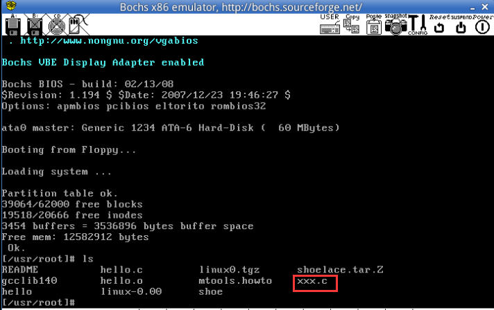

# 哈工大操作系统实验

## 实验一

### 1. 课程说明

本实验是哈工大李治军老师的操作系统课程的配套实验，推荐进行实验之前先学习该课程。

### 2. 主要平台和工具简介

本操作系统饰演的硬件环境是IA-32（x86）架构的PC机，主要软件环境是Bochs+gcc+你最喜欢的编译器+你最喜欢的操作系统+linux0.11源代码。

实验的基本流程是根据实验要求编写应用程序，修改Linux0.11的源代码，用gcc编译后，在Bochs的虚拟环境中运行，调试目标代码。

#### 2.1 x86模拟器Bochs

Bochs是一个免费且开源的IA-32（x86）架构PC机模拟器。在它模拟出的环境中可以运行Linux，DOS和各种版本的Windows等多种操作系统，而Bochs本身具有很高的移植性，可以运行在多种软硬件平台上，这也是我们选择它作为本实验指定的模拟器的原因。

#### 2.2 GCC编译器

GCC是和Linux一起成长起来的编译器，Linux最初的版本就是由GCC编译的，现在GCC也是在自由软件领域应用最广泛的编译器，所以，我们也选择GCC作为本次实验的指定编译器。

#### 2.3 GDB调试器

GDB调试器是GCC编译器的兄弟。作为自由软件领域几乎是唯一的调试器，他秉承了Unix类操作系统的一贯风格，采用纯命令行操作，有点类似dos下的debug。

#### 2.4 Ubuntu（GNU/Linux）

强烈建议在Ubuntu下做实验，因为有些实验内容涉及到在自己改进的Linux0.11下，运行自己编的应用程序，被改进的功能都是高版本Linux内核已经具有的，在其上确认自己编写的应用程序无误后，再用之测试自己改进的Linux0.11，可以更有信心些。

### 3. 实验环境的工作模式

#### （1）准备环境

`hit-oslab`实验环境简称oslab，是一个压缩文件(hit-oslab-linux-20110823.tar.gz)，这个文件已经下载到了**/home/teacher**目录和**/home/shiyanlou/oslab**下，使用下面的命令解压展开压缩包即可工作。

推荐大家使用如下的命令解压到**/home/shiyanlou/oslab**中。

```bash
#进入到oslab所在的文件夹
$ cd /home/shiyanlou/oslab/

# 解压，并指定解压到 /home/shiyanlou/
# 这样的话，在 /home/shiyanlou/oslab/ 中就能找到解药后的所有文件

$ tar -zxvf hit-oslab-linux-20110823.tar.gz -C /home/shiyanlou/

# 查看是否解压成功
$ ls -al
# 除了压缩包hit-oslab-linux-20110823.tar.gz 之外，其他的就是压缩包中的内容
```


#### （2）文件结构

* Image文件

  oslab 工作在一个宿主操作系统上，我们使用的Linux，在宿主操作系统之上完成对Linux 0.11的开发、修改和编译之后，在linux-0.11目录下会产生一个名为**Image**的文件，它就是编译之后的目标文件。

  该文件内已经包含引导和所有内核的二进制代码。如果拿来一张软盘，从它的0扇区开始，逐字节写入Image文件的内容，就可以用这张软盘启动一台真正的计算机，并进入Linux0.11内核。

  >oslab采用bochs模拟器加载这个Image文件，模拟执行Linux0.11，这样省却了重新启动计算机的麻烦。

* bochs目录

  bochs目录下是与bochs相关的执行文件、数据文件和配置文件

* run脚本

  run是运行bochs的脚本命令。

  运行后bochs会自动在它的虚拟软驱A和虚拟硬盘上各挂载一个镜像文件，软驱上挂在是linux-0.11/Image，硬盘上挂载的是hdc-0.11.img。

  因为bochs配置文件中的设置是从软驱A启动，所以Linux0.11会被自动加载。

  而Linux0.11会驱动硬盘，并mount硬盘上的文件系统，也就是将hdc-0.11.img内镜像的文件系统挂载到0.11系统内的根目录——/。在0.11下访问文件系统，访问的就是hdc-0.11.img文件内虚拟的文件系统。

* hdc-0.11.img文件

  hdc-0.11.img文件的格式是Minix文件系统的镜像。

  Linux所有版本都支持这种格式的文件系统，所以可以直接在宿主Linux上通过mount命令访问此文件内的文件，达到宿主系统和bochs内运行的Linux0.11之间交换文件的效果。

  hdc-0.11.img内包含有：

  * Bash shell;
  * 一些基本的Linux命令、工具，比如cp、rm、mv、tar;
  * vi编译器
  * gcc1.4编译器，可用来编译标准C程序；
  * as86和ld86
  * Linux 0.11的源代码，可在0.11下编译，然后覆盖现有的二进制内核。

### 4. 使用方法

开始使用之前的准备活动：把当前目录切换到oslab下，用`pwd`命令确认，用`ls -l`列出目录内容。

```bash
#切换目录
# cd /home/shiyanlou/oslab/

#确认路径
$ pwd

#查看目录内容
$ ls -l
```

本实验的所有内容都在本目录或其下级目录内完成。


#### 4.1 编译内核

“编译内核”比“编写内核”要简单得多。

首先要进入linux-0.11目录，然后执行`make`命令：

```bash
$ cd ./linux-0.11/
$ make all
```

因为`all`是最常用的参数，所以可以省略，只用`make`效果一样。

在多处理器的系统上，可以用`-j`参数进行并行编译，加快速度。例如双CPU的系统可以：

```bash
$ make -j 2
```

make命令会显示很多信息，你可以尽量去看懂，也可以装作没看见，只要最后几行中没有“error”就说明编译成功。

最后生成的目标文件是一个软盘镜像文件——`linux-0.11/Image`。如果将此镜像文件写到一张1.44MB的软盘上，就可以启动一台真正的计算机。


linux-0.11目录下是全部的源代码，很多实验内容都是要靠修改这些代码来完成。修改后需要重新编译内核，还是执行命令：`make all`。

`make`命令会自动跳过未被修改的文件，链接时直接使用上次编译生成的目标文件，从而节约编译时间，但如果重新编译后，你的修改貌似没有生效，可以试试先`make clean`，再`make all`（或者一行命令：`make clean && make all`。`make clean`是删除上一次编译生成的所有中间文件和目标文件，确保是在全新的状态下编译整个工程 ）。

#### 4.2 运行

在Bochs中运行最新编译好的内核很简单，在oslab目录下执行：

```bash
$ cd ~/oslab/

# 执行run脚本
$ ./run
```

如果出现Bochs的窗口，里面显示linux的引导过程，最后停止在`[/usr/root/]#`，表示运行成功，如下图所示：


#### 4.3 调试

内核调试分为两种模式：汇编级调试和C语言级调试

##### （1）汇编级调试

汇编级调试需要执行命令：

```bash
# 确认在oslab目录下
$ cd ~/oslab/

# 运行脚本前确定已经关闭刚刚运行的Bochs
$ ./dbg-asm
```

> 汇编级调试的启动之后Bochs是黑屏，这是正常的。

可以用命令`help`来查看调试系统用的基本命令，跟详细的信息请查阅Bochs使用手册。


##### （2）C语言级调试

C语言级调试稍微复杂一些，首先执行如下命令：

```bash
$ cd ~/oslab
$ ./dbg-c
```

然后再打开一个终端窗口，执行：

```bash
$ cd ~/oslab
$ ./rungdb
```

> 注意：启动的顺序不能交换，否则gdb无法连接

出现下图所示的提示，说明连接成功：


新终端窗口中运行的是GDB调试器。关于gdb调试器请查阅GDB使用手册。

#### 4.4 文件交换

接下来讲解一下Ubuntu和Linux 0.11之间文件交换如何启动。

> 开始设置文件交换之前，务必关闭所有的Bochs进程。

oslab下的`hdc-0.11-new.img`是0.11内核启动后的根文件系统镜像文件，相当于在bochs虚拟机里装在的硬盘，在Ubuntu上访问其内容的方法是：

```bash
$ cd ~/oslab/

#启动挂载脚本
$ sudo ./mount-hdc
```

> 使用sudo时，password是shiyanlou，也有可能不会提示输入密码。

之后，hdc目录下就是和0.11内核一模一样的文件系统了，可以读写任何文件（可能有些文件要用sudo才能访问）。

```bash
#进入挂载到Ubuntu上的目录
$ cd ~/oslab/hdc

#查看内容
$ ls -al
```

读写完毕，不要忘了卸载这个文件系统：

```bash
$ cd ~/oslab/

#卸载
$ sudo umount hdc
```

经过sudo ./mount-hdc这样处理以后，我们可以在Ubuntu的hdc目录下创建一个xxx.c文件，然后来利用Ubuntu上的编辑工具（如gedit等）实现对xxx.c文件的编辑工作。

执行`sudo umount hdc`后， 再进入Linux0.11(即run启动bochs以后)就会看到这个xxx.c（即如下所示）,这样就避免了在Linux0.11上进行编辑xxx.c的麻烦，因为Linux 0.11 作为一个很小的操作系统，其上的编辑工具只有vi,使用起来非常不方便。



另外在Linux 0.11上产生的文件，如后面实验中产生的process.log文件，可以按这种方式”拿到“Ubuntu下用python程序进行处理，当然这个python程序在Linux0.11上显然是不好使的，因为Linux0.11上搭建不了python解释环境。

>注意1：不要再0.11内核运行的时候mount镜像文件，否则可能会损坏文件系统。同理，也不要在已经mount的时候运行0.11内核。
>
>注意2：在关闭Bochs之前，需要先在0.11的命令行运行“sync”，确保所有缓存数据都存盘后，再关闭Bochs。


